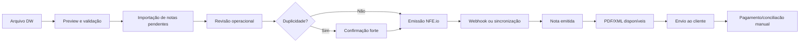
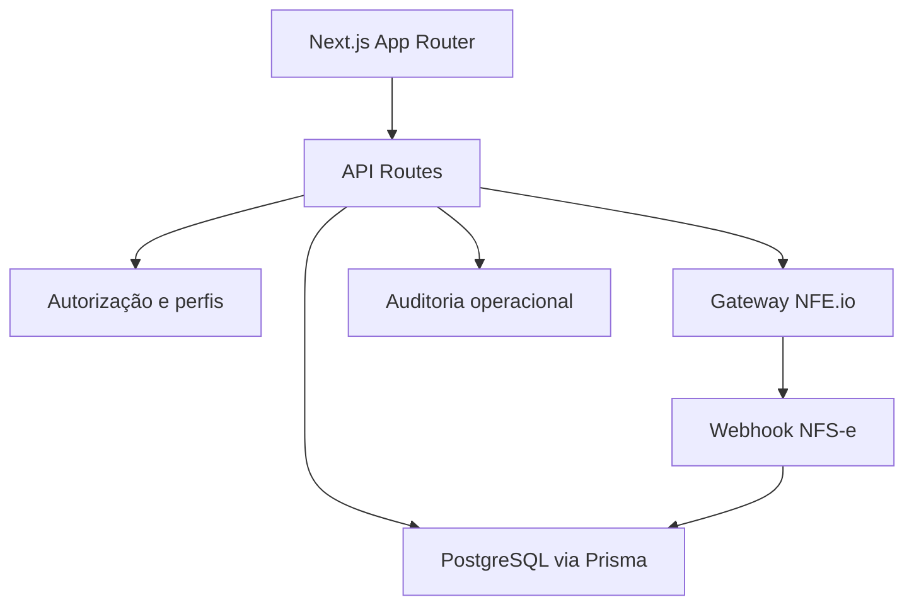

# Gestão Imob

### Plataforma de gestão financeira, fiscal e operacional para imobiliárias

Um sistema interno construído para centralizar rotinas críticas de uma operação imobiliária: controle financeiro, importação de dados operacionais, emissão de NFS-e, auditoria, saúde do ambiente e governança de homologação antes de produção.

---

## Visão Geral

O Gestão Imob foi desenvolvido para resolver um problema real de operação: reduzir dependência de planilhas soltas, organizar o fluxo fiscal de NFS-e e dar visibilidade para rotinas financeiras que normalmente ficam espalhadas entre DW, banco, documentos, controles manuais e portais externos.

A aplicação combina uma interface operacional para usuários não técnicos com áreas restritas para administração, saúde do sistema, auditoria e governança de ambiente.

---

## O que o sistema faz

### NFS-e e fluxo fiscal

- Importa arquivos DW em `.xlsx`, `.xls` e `.csv`.
- Valida dados antes de gravar.
- Detecta duplicidades antes da emissão.
- Emite NFS-e via NFE.io em ambiente de homologação.
- Sincroniza status da nota com o gateway.
- Disponibiliza PDF e XML dentro do sistema.
- Registra histórico visual de cada nota.
- Permite marcar envio ao cliente e pagamento/conciliacão manualmente.
- Bloqueia fluxos perigosos entre HML e PRD por variáveis de ambiente.

### Operação financeira

- Centraliza módulos de receitas, despesas, extratos e relatórios.
- Organiza comissões, folha operacional e campanhas.
- Mantém telas antigas protegidas contra dados falsos quando o banco real não está disponível.
- Prepara o caminho para conciliação bancária futura.

### Governança e segurança

- Separação clara entre Local, HML e PRD.
- Perfil técnico para administração e saúde operacional.
- Perfis operacionais para uso diário sem acesso técnico.
- Auditoria de eventos relevantes.
- Documentação de processo, runbook e critérios de promoção de HML para PRD.
- Política de não versionar segredos, credenciais ou arquivos `.env`.

---

## Fluxo de NFS-e

---

## Arquitetura

### Principais tecnologias

| Camada | Tecnologia |
| --- | --- |
| Frontend | Next.js, React, TypeScript |
| Backend | Next.js API Routes |
| Banco | PostgreSQL |
| ORM | Prisma |
| Validação | Zod |
| Autenticação | NextAuth |
| Deploy | Railway |
| Gateway fiscal | NFE.io |

---

## Ambientes

| Ambiente | Papel |
| --- | --- |
| Local | Desenvolvimento e ajustes técnicos. |
| HML | Validação operacional com dados controlados e gateway em teste. |
| PRD | Operação real, liberada apenas após HML validado. |

O projeto adota uma regra simples: **PRD não é ambiente de teste**.

---

## Diferenciais do projeto

- Fluxo fiscal desenhado com foco em redução de erro humano.
- HML tratado como etapa obrigatória antes de PRD.
- Documentação de operação e engenharia versionada no repositório.
- Proteção contra emissão duplicada.
- Separação entre status fiscal e status financeiro.
- Design operacional voltado para usuário leigo, sem esconder informações críticas.
- Base preparada para evolução: conciliação bancária, automação de envio e rotinas fiscais mais avançadas.

---

## Documentação

A documentação técnica e operacional fica em [`docs/`](./docs/README.md).

Documentos principais:

- [`docs/ambientes-e-governanca.md`](./docs/ambientes-e-governanca.md)
- [`docs/hml-nfse-validacao.md`](./docs/hml-nfse-validacao.md)
- [`docs/runbooks/nfse-hml.md`](./docs/runbooks/nfse-hml.md)
- [`docs/processo-desenvolvimento.md`](./docs/processo-desenvolvimento.md)
- [`docs/prd-readiness.md`](./docs/prd-readiness.md)

---

## Estado Atual

O fluxo de NFS-e está validado em HML para:

- importação DW;
- emissão em ambiente de teste;
- retorno de status;
- download de PDF;
- sincronização com NFE.io;
- controle operacional de envio e pagamento;
- bloqueio de duplicidade.

O próximo estágio é consolidar a validação fiscal com cliente/contador antes de qualquer promoção para PRD.

---

## Segurança para repositório público

Este repositório foi preparado para não versionar arquivos `.env`, chaves de API, senhas, certificados ou dados reais de operação.

Antes de tornar o repositório público, siga o guia:

[`docs/publicacao-repositorio.md`](./docs/publicacao-repositorio.md)

---

**Projeto desenvolvido com foco em operação real, segurança fiscal e maturidade de processo.**

